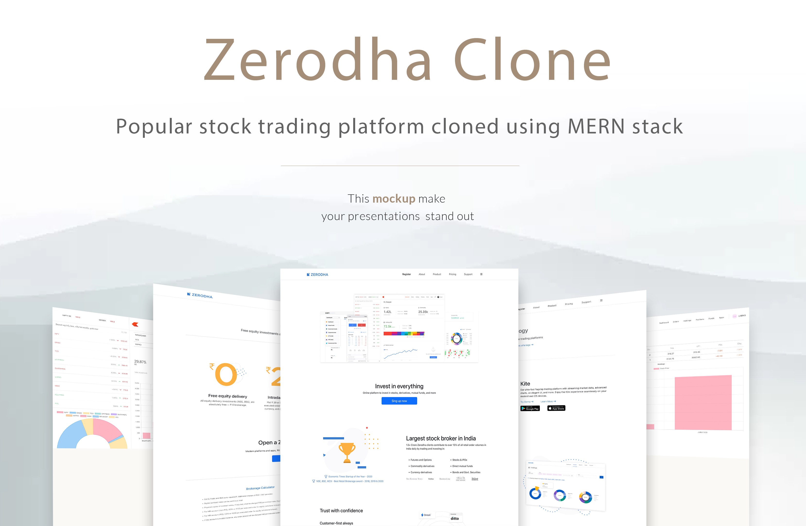
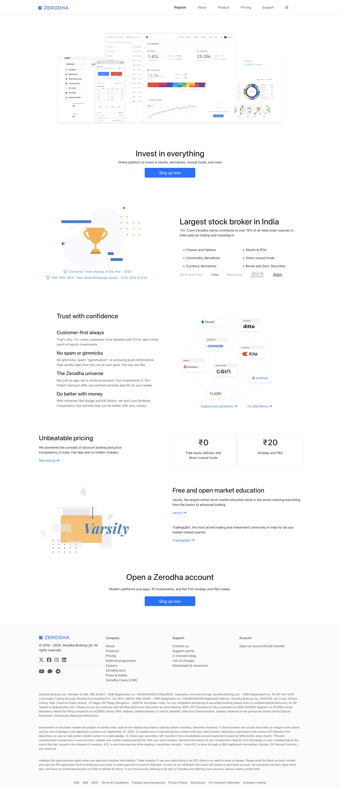
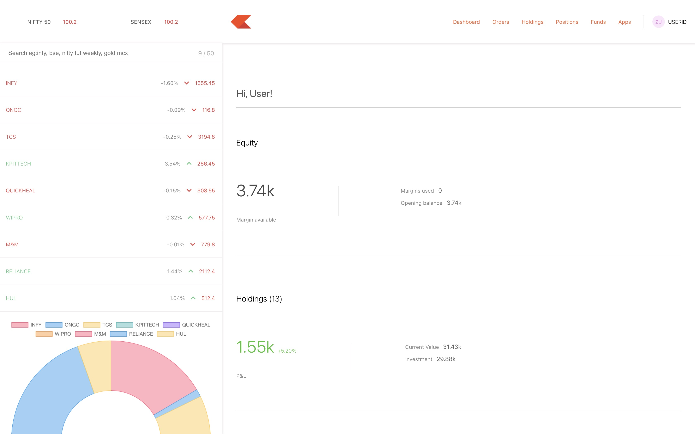
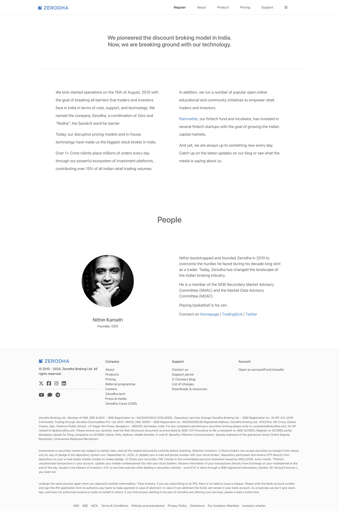
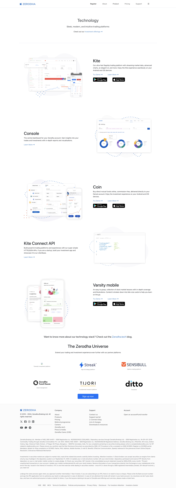
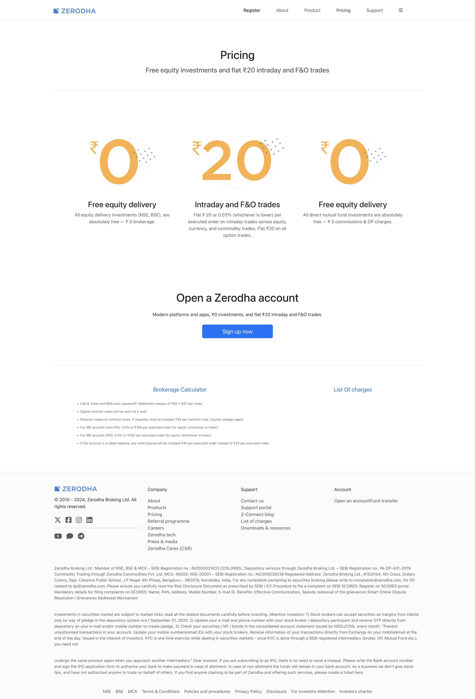
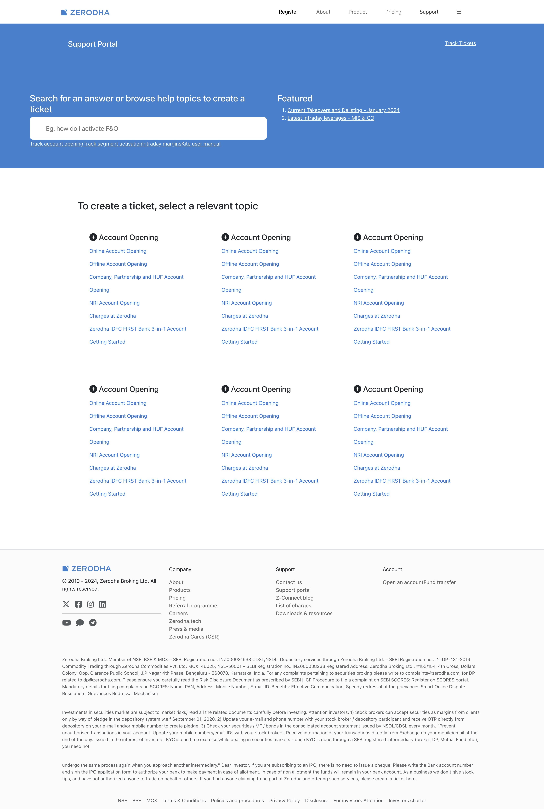

# 📈 Stock Trading Platform

Welcome to **Stock Trading Platform**! This project is a full-stack web application inspired by modern online trading platforms. Built using the MERN stack, it provides a secure and interactive environment where users can manage portfolios, place stock orders, and monitor their investments through an intuitive dashboard.

---

## 📑 Table of Contents

1. [Overview](#-overview)
2. [Technologies](#-technologies)
3. [Packages & Libraries Used](#-packages--libraries-used)
4. [Getting Started](#-getting-started)
5. [Setup](#-setup)
6. [Features](#-features)
7. [Demo & Screenshots](#-demo--screenshots)
8. [Acknowledgments](#-acknowledgments)
9. [License](#-license)

---

## 🌟 Overview

**Description**: A clone of the popular stock trading platform, Zerodha, built using the MERN stack.

---

## 💻 Tech Stack

Below is a breakdown of the core technologies used in this project.

| 🌐 Web       |
| ------------ |
| **React.js** |
| **Node.js**  |
| **MongoDB**  |

---

## 📦 Packages / Libraries Used

This project uses the following essential libraries and packages:

| Package / Library  | Purpose                       |
| ------------------ | ----------------------------- |
| `Bootstrap 5.3`    | Responsive design             |
| `Material UI`      | UI Components                 |
| `Express.js`       | Backend framework             |
| `Mongoose`         | MongoDB object modeling       |
| `Bcrypt`           | Password hashing              |
| `Jwt`              | JSON Web Token                |
| `Charts.js`        | Data visualization            |
| `Axios`            | HTTP client                   |
| `React Router Dom` | Client-side routing           |
| `Passport`         | Authentication                |
| `cors`             | Cross-origin resource sharing |
| `Body-Parser`      | Body parsing middleware       |

---

## 🚀 Getting Started

Follow these steps to set up the project in your local environment:

1. Clone the repository:
   ```bash
   git clone https://github.com/triveninelakurthi9/StockTradingPlatform.git
   ```
2. Install dependencies for Backend, Frontend, and Dashboard.

   ```bash
   cd backend
   npm install
   ```

   ```bash
   cd ../dashboard
   npm install
   ```

   ```bash
   cd ../frontend
   npm install
   ```

3. Configure environment variables for the backend. Create `.env` in the `backend` folder with following :
   ```env
   PORT=3000
   MONGO_URL="Your Mongo Database Url"
   secret="Your Unique JWT Secret"
   ```
4. Run the web application:
   ```bash
   npm start
   ```

---

## ⚙️ Setup

1. Go to `localhost:3000`.
2. Register a new user.
3. Explore the dashboard.

---

## 🎯 Features

This application provides the following features:

- Secure User Authentication (JWT)
- User Authorization
- Portfolio Dashboard
- Holdings Management
- Buy & Sell Stock Orders
- Order Management
- Responsive User Interface
- RESTful API Integration
- MongoDB Database Connectivity

---

## 🔗 Demo & Screenshots

- [Demo](https://stock-trading-platform-nine.vercel.app/)
- UserName : Demo
- Password : Demo

| Mock Up                            | Home Page                             | Dashboard                              | About Page                         |
| ---------------------------------- | ------------------------------------- | -------------------------------------- | ---------------------------------- |
|  |  |  |  |

| Products Page                        | Pricing Page                         | Support Page                         |
| ------------------------------------ | ------------------------------------ | ------------------------------------ |
|  |  |  |

---

## 🙏 Acknowledgments

We’d like to thank the following contributors and resources:

- **[Apna College's Sigma 6.0 Course](https://www.apnacollege.in/)** - Course resource.
- This project is developed for educational purposes.
- Inspired by the Zerodha trading platform.
- Built while learning full-stack development using the MERN stack.

---

## 📜 License

This project is licensed under the [MIT License](LICENSE). See the [LICENSE](LICENSE) file for details.

---

### Thank you for exploring and contributing to Stock Trading Platform!!
